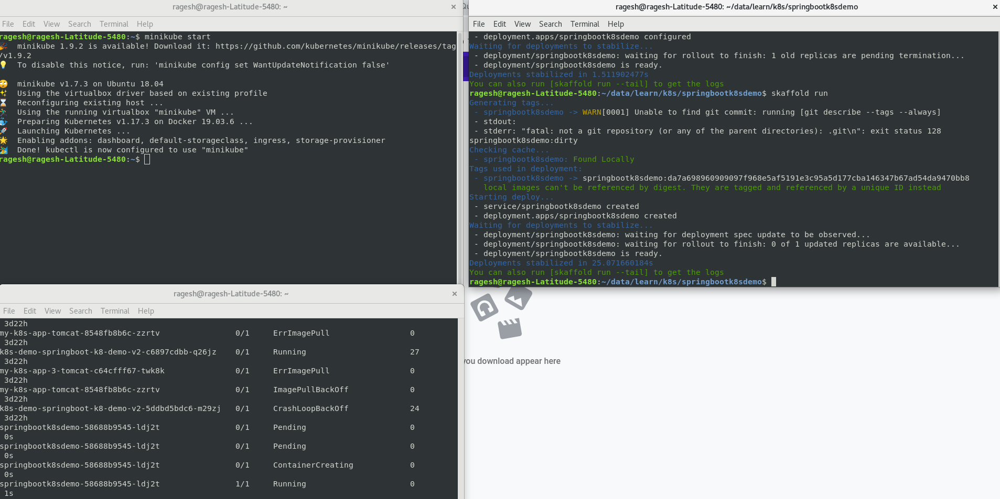
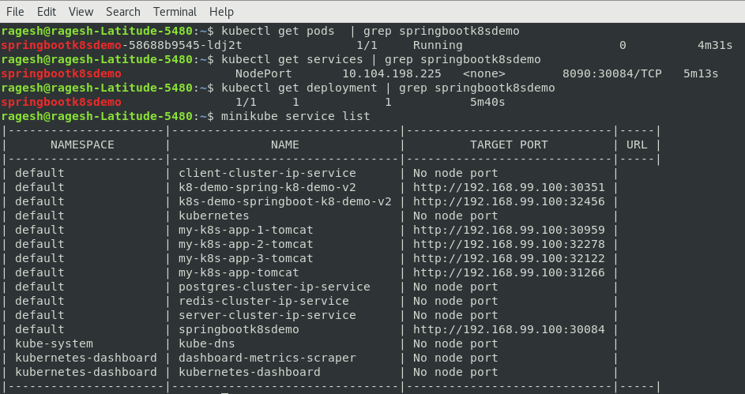
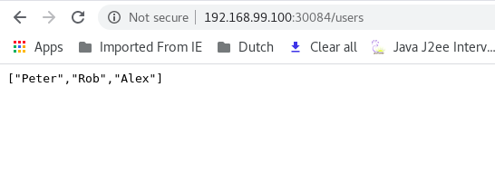

# springboot-kubernetes-demo
This project explains how to deploy springboot app in kubernetes using skaffold

### Prerequisites

* Minikube v1.7.3
* Kubernetes v1.17.3
* Docker 19.03.8
* Spring boot 2.2.6.RELEASE

### Skaffold

>Skaffold is a command line tool that facilitates continuous development for Kubernetes-native applications. Skaffold handles the workflow for building, pushing, and deploying your application, and provides building blocks for creating CI/CD pipelines. This enables you to focus on iterating on your application locally while Skaffold continuously deploys to your local or remote Kubernetes cluster.

**Installation for linux**

```
curl -Lo skaffold https://storage.googleapis.com/skaffold/releases/latest/skaffold-linux-amd64
chmod +x skaffold
sudo mv skaffold /usr/local/bin

```
Refer this link: https://skaffold.dev/docs/install/

Check the version after the installation

Open terminal and run this command **skaffold version**

**Key Commands**
* Use **_skaffold dev_** to build and deploy your app every time your code changes
* Use **_skaffold run_** to build and deploy your app once, similar to a CI/CD pipeline

### Application demo

This is the simple spring boot rest application which shows the list of users when you run this application.

I used Dockerfile for creating an image of this application.

I am going to explain only how can we deploy this application in k8s through skaffold.

### Architecture


### How Skaffold deploy the application in k8s

**skaffold.yaml**

```
apiVersion: skaffold/v1
kind: Config
build:
  artifacts:
    - image: springbootk8sdemo
      docker:
        dockerfile: Dockerfile
  local: {}

deploy:
  kubectl:
    manifests:
      - deploy.yaml

```
The above yaml file has the configuration about build artifacts to prepare an image for k8s and also it includes the deploy.yaml file which has information about deployment and services to deploy our application in k8s cluster.


**deploy.yaml**

```
apiVersion: v1
kind: Service
metadata:
  name: springbootk8sdemo
spec:
  selector:
    app: springbootk8sdemo
  ports:
    - protocol: TCP
      port: 8090
      nodePort: 30084
  type: NodePort
---
apiVersion: apps/v1
kind: Deployment
metadata:
  name: springbootk8sdemo
spec:
  selector:
    matchLabels:
      app: springbootk8sdemo
  replicas: 1
  template:
    metadata:
      labels:
        app: springbootk8sdemo
    spec:
      containers:
        - name: springbootk8sdemo
          image: springbootk8sdemo
          imagePullPolicy: Never
          ports:
            - containerPort: 8090

```

Key points to remember

* The deploy.yaml has details about deployment and service.
* In deployment, mentioned containerPort as 8090 where we configured in our application.
* The same port number should be used in service port.
* I used service type as NodePort which has port number 30084. If not given any port,it will take random port (range 30000 - 32767)
* Verify the label names in deployment and service. It should be the same.


### How to run

* Open terminal and go to your project folder
* Run the command **skaffold run**
    It will create a docker image in kubernetes pod. It will pick deploy.yaml file and also creates deployment and service in k8s.

Note: **skaffold dev** command will re-run everything when you do any changes in the application.

### screenshots







### Happy Coding

